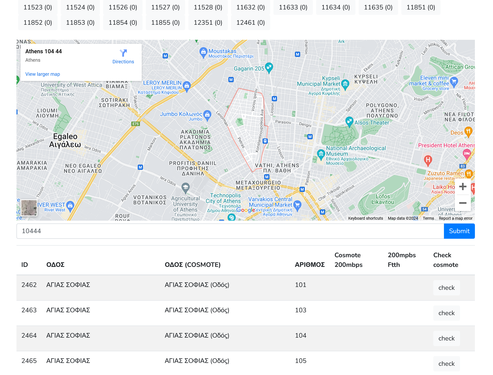
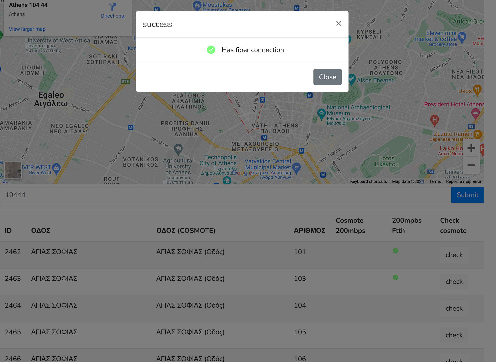

# Sfbb (Superfast Broadband) availability tool [](https://codecov.io/gh/nklido/sfbb)

I created this tool to help me relocate to Athens and find an area that
supports a fiber connection. Growing up in a place with 2Mbps speed, I just had to make sure 😂

By scraping data from [sfbb](https://sfbb.gr/) and [Cosmote](https://www.cosmote.gr/hub/)


|  |  |
|-----------------------------------|--------------------------------------|


## Docker Setup (Laravel Sail)

### Requirements
* Docker
* Docker compose

## Installation

For a first time installation run

```bash
docker run --rm \
    -u "$(id -u):$(id -g)" \
    -v $(pwd):/var/www/html \
    -w /var/www/html \
    laravelsail/php81-composer:latest \
    composer install --ignore-platform-reqs
```

Copy the example .env file and add your GOOGLE_MAPS_API_KEY:

```bash
    cp .env.example .env
```

Set you database host, username and password and make sure you create
a database with name `sfbb`. 

```bash
DB_DATABASE=sfbb
DB_USERNAME=<your-db-username>
DB_PASSWORD=<your-db-password>
```

To start the containers run:
```
./vendor/bin/sail up -d
```

Access a shell in the application container:

```bash
./vendor/bin/sail shell
```

and setup the database by running
```bash
php artisan migrate:fresh --seed
```

## Testing

You can run the tests by running

```bash
./vendor/bin/phpunit
PHPUnit 9.5.10 by Sebastian Bergmann and contributors.

......                                                              6 / 6 (100%)

Time: 00:04.028, Memory: 96.00 MB

OK (6 tests, 16 assertions)

```

